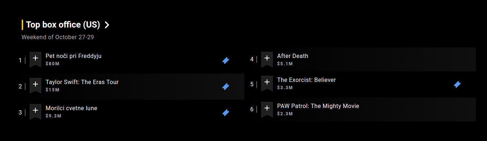
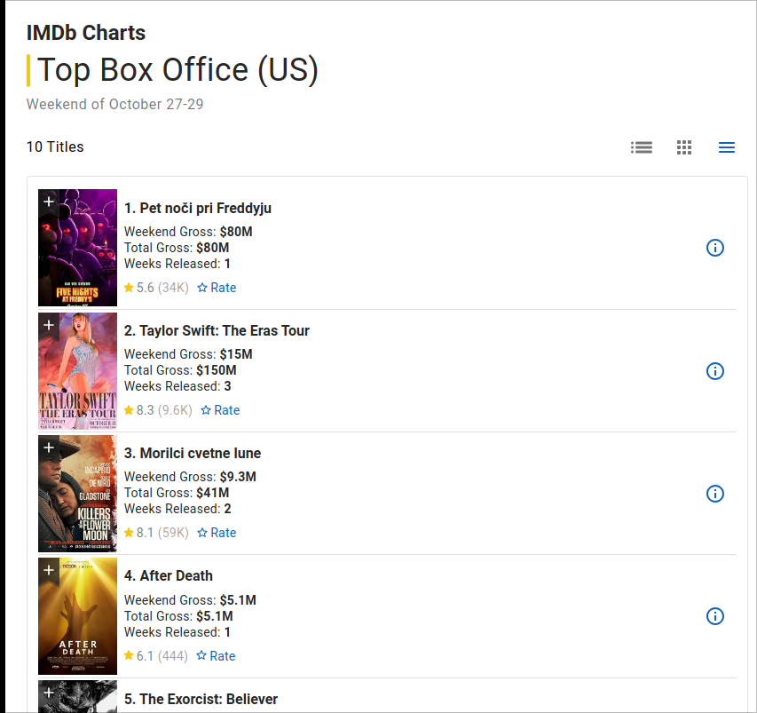
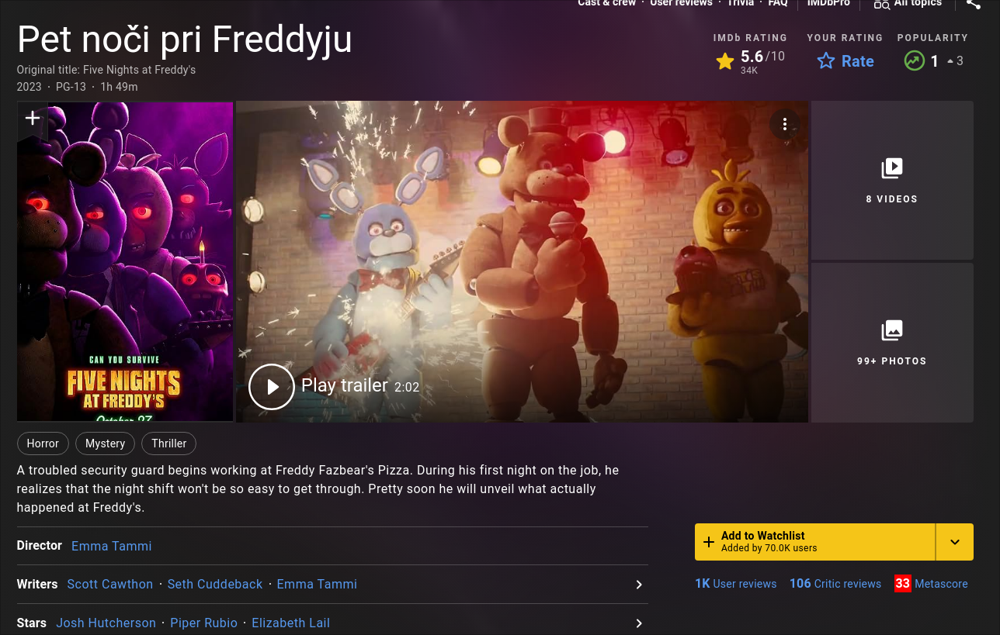

We will be scraping [IMDB](https://www.imdb.com) and obeying their [robots.txt](https://www.imdb.com/robots.txt). The section of the robots.txt that applies to us is under `User-agent: *`. For example the line `Disallow: /find
` forbids (or more appropriately, asks us nicely) to not use the find functionality through bots.

Note: IMDB has an API and it would be more suitable for this as discussed during the tutoring sessions, however we will stick to browser automation for scraping so that you practice for your hands-on exam.

The goal of this task is to scrape the top 10 (box office) movies and some data about them. You can find them by going to the [IMDB homepage](https://www.imdb.com) and scrolling down until you see something like this:


Clicking on the `Top box office (US)` brings you [to the following page](https://www.imdb.com/chart/boxoffice/?ref_=hm_cht_sm) containing the top 10 movies you need to scrape (only 6 are shown by default)
.

I want you to implement a scraper with Selenium **that starts on the homepage (for practice reasons)**. Although in practice, you would choose the link of the top box office chart as the starting point.

The page of each movie (if you click on the movie title in the chart) looks something like this:


The details you should scrape for each of the top 10 box office movies are (based on the screenshot example):
- The movie title `Pet noči pri Freddyju` (this might be in English depending on your PC, don't worry about it)
- The year `2023`
- The duration `1h 49m` (this should be saved in an appropriate format, that is easy to work with programmatically - e.g. duration in minutes).
- The IMDB rating `5.6`
- The tags/genres `[Horror, Mystery, Thriller]`
- The plot `A troubled security guard begins...`

Save the data you scrape to a CSV file and to a JSON file. By doing this you will notice that sometimes, a dictionary structure can be more appropriate for data storage (the tags/genres, which is a bit clunky to store in a tabular, CSV structure, but is native to JSON).

Sample output (CSV):
```csv
title,year,duration,rating,tags,plot
Five Nights at Freddy's,2023,109,5.6,Horror|Mystery|Thriller,"A troubled security guard begins working at Freddy Fazbear's Pizza. During his first night on the job, he realizes that the night shift won't be so easy to get through. Pretty soon he will unveil what actually happened at Freddy's."
...
```

Sample output (JSON):
```json
[
    {
        "title": "Five Nights at Freddy's",
        "year": "2023",
        "duration": 109,
        "rating": 5.6,
        "tags": [
            "Horror",
            "Mystery",
            "Thriller"
        ],
        "plot": "A troubled security guard begins working at Freddy Fazbear's Pizza. During his first night on the job, he realizes that the night shift won't be so easy to get through. Pretty soon he will unveil what actually happened at Freddy's."
    },
...
]
```
